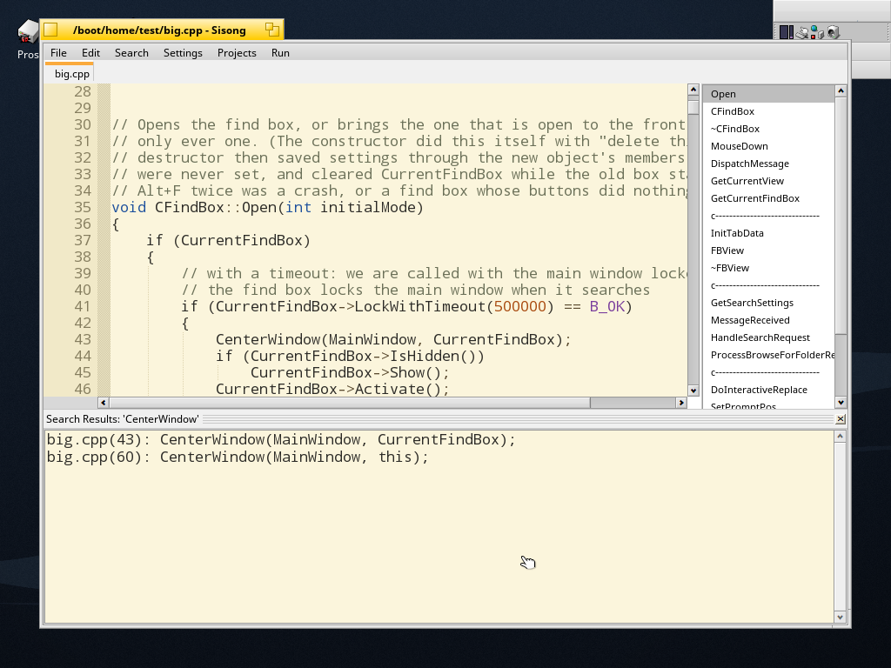
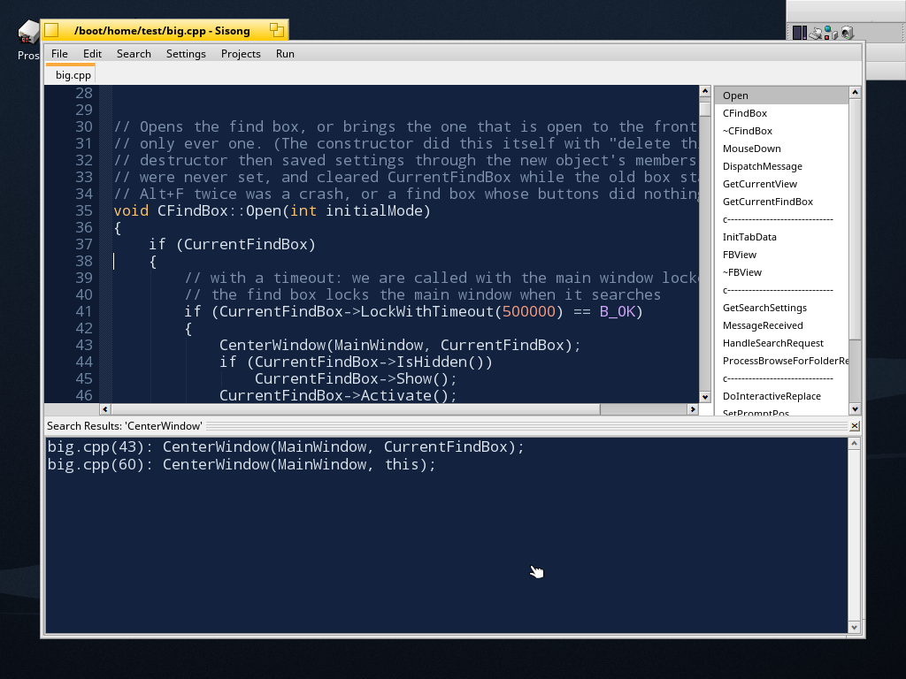

# Sisong on Prose

Sisong is a programmer's editor and small IDE for BeOS and Haiku by Caitlin
Shaw (©2009, GPL 3): documents in tabs, syntax colouring, a function list,
brace matching, smart indenting, find and replace in a document, in all open
documents and in files, projects with a build script, and a build pane that
colours compiler output and jumps to the first error.





| | |
|---|---|
| Upstream | <https://github.com/HaikuArchives/Sisong>, `master` at `a79c29ea0941` (2020-03-10) |
| Imported | the whole tree (`LICENSE`, `README`, `common/`, `src/`) in commit "ports: import Sisong as upstream has it", less one build product, `src/IComponent/CursorPos/CursorPos` (a 32-bit x86 executable) |
| Licence | GPL 3, the author's (`LICENSE`); the port's changes are under the same |
| Version | 2.16: upstream's last resource file said 2.16, and the About box says "Release Candidate 2, Revision 16" |
| Package | `sisong-2.16-1-arm64.hpkg`, from the recipe `packages/builder/overlay/haiku-apps/sisong/` of the Prose repository, which builds a pinned commit of this one; in the Prose image since its patch 0070, Deskbar folder Development |
| The port | every commit after the import that touches this directory: `git log -- ports/Sisong` |

Upstream's `README` is as it came and describes upstream's build. This file
describes the port.

## Building

```sh
make                 # objects/Sisong, with its resources and MIME attributes
make OBJ_DIR=/tmp/o  # somewhere else
```

Needs `g++`, `rc`, `xres` and `mimeset` by those names: true on Prose, and in
the `prosepkg` build environment on the Mac, which is how the package is
made (`scripts/prosepkg build sisong` in the Prose repository). It links
`libbe` and `libtracker` and nothing else.

The port's `Makefile` replaces upstream's `src/Makefile` and
`src/Makefile.gcc2`, which are gone: they were generated by the author's
`makegen` (not part of the source) from `src/makelist.ml`, one `g++ -g -c`
line per file, for x86, without optimisation or resources. Building this
tree with them would give a program that compiles and misbehaves, because
of the first flag below. `src/makelist.ml` stays as upstream's record of
which files make up the program; the list in `Makefile` follows its first
section. The `*.fdh` files are `makegen`'s output too (prototypes of each
file's functions): with no `makegen`, a changed signature is changed there
by hand.

Flags that matter:

- `-fsigned-char`. Plain `char` is unsigned on arm64 and signed on x86, and
  this code was written on x86: characters compared with -1, small negative
  numbers kept in `char`. The flag keeps the meaning the code was written
  and tested with. It does not change the ABI.
- `-O2 -Werror=return-type`. At `-O2` gcc 13 compiles a value-returning
  function that falls off its end as code that runs on into the next
  function. One did (below), so that warning is an error here.
- `-fno-strict-aliasing`: buffers are read through cast pointers.

## What the port changed

Found by running it on Prose (arm64, QEMU/HVF), and by an audit of the
22,000 lines for what changes between the machine it was written on and
this one. Every item was confirmed in the source, and in the guest where it
could be provoked.

**The system it runs on**

- *The fonts it looks for, and a font of one's own.* It asks for JetBrains
  Mono and Fira Code before the system's own monospaced families: both are
  in the Prose image (patch 0075) and both are made for reading code.
  `be_fixed_font` still wins when the system's fixed font really is fixed.
  The Font/Colors page of the preferences now lists every fixed family the
  machine has (plus "System Fixed Font" for the choice above), applies the
  one picked at once, and keeps it in the `font_family` setting between
  runs; a family that has gone missing falls back to the choice above,
  silently.
- *A fixed-width font that is fixed.* The editor places text, cursor and
  selection on a grid of cells and drew with `be_fixed_font` as it found it.
  That font is only as fixed as the fonts installed: the Prose image has
  "Noto Mono", the app_server's default fixed family is "Noto Sans Mono",
  and its fallback gave "Bitstream Charter", a proportional serif
  (measured on the image of 2026-09-20), so every token stood apart from
  its columns. `CFontDrawer` now uses `be_fixed_font` if it is fixed
  and otherwise the first fixed family there is (`GetFixedFont()`), and it
  draws every character at its cell instead of letting the server advance
  by the font's own, possibly fractional, width. The build and search
  result panes use the same font.
- *Files named on the command line* were ignored (`Sisong foo.cpp` opened an
  empty document). `EApp::ArgvReceived()` opens them, relative to the
  caller's directory. The application is **single launch** now (upstream's
  last resource file said multiple): a file opened from Tracker or a
  second `Sisong file` becomes a tab in the running window, which is what
  tabs are for. The untouched "new 1" the editor starts with closes when a
  real file opens beside it.
- *No update check.* On every start `NotifyUpdate.cpp` ran `wget` against
  `http://five75.sourceforge.net/ucheck.php` and showed whatever the
  server sent in an alert. A program in the Prose image does not phone
  home; the file and its preference are gone.
- *Command+Control shortcuts* (Save All, Close All, Find in files, Find
  Previous, Build but Don't Run, Abort Compile, Save Layout 1-3) did
  nothing: with Control held the keymap turns the key's text into a control
  character, or into nothing for the digits, the Interface Kit finds no
  shortcut for that, and the key started one of the editor's own
  Control+key command sequences instead. The window now finds those menu
  items by the key's own character.
- *Timers* (the cursor, the About box, the statistics page) were threads
  that slept and posted a message, ended with `kill_thread()`: whatever lock
  the thread held at that instant stayed held. They are `BMessageRunner`s.
- *Build scripts* were started with `vfork()`, which here is the bare system
  call without the heap's fork hooks: in a program with other threads the
  child could wait for ever on a malloc lock before it ran `bash`. `fork()`;
  the child leaves with `_exit()`; a child that was aborted is reaped.
- *The debug log* went beside the executable (an installed package is
  read-only) or into the author's `/boot/dev/sisong/`. It is written only
  when `SISONG_LOG=/some/file` asks for it. The attempt to open
  `/boot/dev/sisong/src/borkme` at startup is gone, and so is the six-line
  jump the cursor made after loading a document: it starts on line 1.
- *The mouse wheel* went by the delta cut to an `int`: a delta under one
  line, or a purely horizontal event, scrolled up.
- *The file browser* (New Project, templates) opened every file of a folder
  to seek to its end for the size -- device nodes too under `/dev` -- and
  kept the size in 32 bits. `BEntry::GetSize()`.
- Resources (`prose/Sisong.rdef`): signature `application/x-vnd.KT-Sisong`,
  version, "text" and `text/x-source-code` as the types it opens (a type the
  system does not know would be created by `mimeset` inside the package,
  with Sisong as its preferred application), and an icon (`prose/Sisong.svg`;
  upstream had none).

**Three things the port added** (asked for by the owner)

- *Edit > Complete Word* (Alt+/): completes the word before the caret from an
  index of the Be/Haiku API — every class, method, function, constant and
  macro of the public headers (about 16,000 names, with what each is and the
  header it lives in). A word only one thing can be is finished without a
  list; otherwise a list opens beside the word: the arrow keys walk it,
  enter takes, escape closes, and any other key goes to the editor and
  closes it. Matching ignores case, so `btextv` completes to `BTextView`
  (typed with other letters than the name, the word gives way to the name).
  The index is `api-index` in this directory, made by Prose's api-db
  (`prosewriter/api-db/build_db.py --export-sisong`), read at first use
  from `data/sisong/api-index` of the system, or the user's non-packaged
  data directory (a build in progress, tried without installing); without
  it the command still asks the language server. What the list inserts is
  one undo step. `src/api_complete.cpp` is all of it; upstream's lexer had
  a `load_keywords_from_file()` that was never called, so an editor fed
  from a file of API words was already half its author's idea.

  For a C or C++ document the same command also asks `clangd_server`
  (Prose's BeOS shape around clangd, `clangdserver/` of the Prose
  repository): a session is opened with the server on the first question,
  and from the second on, the document's text goes with the question and
  the server's completions join the list after the index's, marked by what
  clangd knows them as (a member of a struct in the document itself, a
  keyword, a macro). Its diagnostics about the document show in the
  message pane under the menu bar. `src/lsp_client.cpp` speaks the
  BMessage protocol of `src/lsp_protocol.h`; without the server running,
  none of this happens and the index stands alone.
- *File > New C++ Source* (Shift+Alt+N): a new document with the bones of a
  C++ program in it, cursor on the line inside `main()`. It is an ordinary
  untitled document; nothing is written until it is saved.
- *Run > Compile This File* (Alt+B) and *Compile and Run This File*
  (Shift+Alt+B): compile and link the document being edited on its own, with
  no project around it. The file is saved first, the compiler runs in its own
  folder, and the executable is made beside it, named after it. Output,
  errors and exit codes appear in the build pane exactly as a project build's
  do, so a compiler's `file:line: error` is still a line to click. The pane
  stays open afterwards, where a project build closes it: one file's build is
  an answer in itself, and with Run it holds the program's output.
  The command is the setting `SingleFileBuildCommand` in
  `~/config/settings/Sisong/settings`, where `%f` is the source file, `%e` the
  executable to make and `%d` the folder. It defaults to
  `g++ -g -Wall -o %e %f -lbe`.
  **The Prose image has no compiler yet** (only `gcc_syslibs`, the runtime
  libraries), so out of the box this says so and names the setting to change,
  instead of leaving the shell to answer "command not found".

**How it looks**

- *Two new colour schemes, and they are the defaults.* **Paper**: dark ink on
  a light yellow ground, like paper. **Midnight Blue**: light ink on a dark
  blue ground, for a dark desktop. A new user gets Paper, or Midnight Blue if
  the desktop's own document background is dark; both are at the top of the
  Settings menu, above upstream's five (Maroon Mountain, its old default,
  among them). Every ink was checked against its ground: text is 13:1 and
  12:1, and no token is under 4.5:1. The scheme last used is remembered by
  its index, so settings written before this set of schemes existed start on
  the default.
- *Everything that shows the editor's colours follows a change of scheme.*
  The build, build help and search results panes were light inks on black
  whatever the editor looked like, and kept the colours they were made with;
  they take the editor's ground, inks chosen for a light or a dark ground,
  and change with the scheme while they are showing. The strip between the
  line numbers and the text was a black and white dither; it is a fine
  dither of the gutter's own colours.

**64 bits, arm64, gcc 13**

- `Spinner.cpp`: `sscanf("%ld")` into an `int32` wrote eight bytes into
  four; `sprintf("%ld")` of one read four bytes that were not passed.
  `B_SCNd32`/`B_PRId32`. `tabs.cpp` printed a pointer with `%x`.
- `run_template_selector()` was declared `char *` and returned nothing.
- `fgetcsv()` kept `fgetc()` in a `char` and compared it with -1.
- Checked and clean: no pointer travels through an `int32` message field,
  every table of 256 entries is indexed through `unsigned char`, the mouse
  wheel's negative key codes never pass through a `char`, and no structure
  is written to disk as raw bytes.

**Crashes and hangs that were upstream's**

- *Alt+F with the find box open.* `CFindBox`'s constructor, finding a box
  already open, did `delete this`; the destructor then saved settings
  through the new object's members, never set, and cleared
  `CurrentFindBox` while the old box stayed up: a crash, or a find box
  whose buttons did nothing. `CFindBox::Open()` brings the open box forward.
- *Escape in an input box* (New Folder, New File, a colour scheme's name)
  called `Quit()` on the window that `InputBox::Go()` was still polling: a
  use after free. Escape only sets the flags now.
- *The About page* is the first thing Preferences shows, and its
  `rotate_frame` was never initialised: a negative leftover indexed
  `colors[]` far outside the array on the first tick.
- *A click in the left half of the first cell of an empty line* read the
  byte before the line's text and left the cursor at column -1.
- *A word longer than 2047 characters* (a hex blob, base64) overran the
  lexer's `char word[2048]` on the stack: opening the file was enough.
- *New Project's OK* worked on the main window -- documents, tabs, the
  bottom pane -- from its own window's thread without the main window's
  lock. With the bottom pane open that removes a view from an unlocked
  window, which the Interface Kit answers with a call to the debugger.
- *Closing Preferences could hang the program.* A preflet's destructor, on
  the window's thread and holding the window's lock, waited for its own
  looper's lock; the looper, holding that while it dispatched a timer's
  message, waited for the window's. The window stayed half closed and the
  next "Preferences..." hung the main window on it. The looper now waits in
  slices and gives up when the view says it is going.
- *Stopping a build* raced: the build thread deleted the semaphore the
  window was about to wait on, the wait failed at once, and the window
  killed a thread that was still running. The thread now releases the
  semaphore once, last thing, asked or not, and only the window's side
  deletes it. The script command `hide` made the two meet.
- A key or wheel event in the moment between the window showing and the
  first document opening went through unset pointers.
- `ProcessRefs()` made an unset pointer the active tab when nothing could
  be opened; a `B_KEY_DOWN` without `bytes` dereferenced one;
  `UpdateProjectsMenu()` could return holding `ChangeMenusLock`.

**Text that was lost or damaged**

- *Long lines corrupted files.* A document was read into `char[1024]`, so a
  line over 1022 characters arrived as several, and saving wrote those
  breaks into the file. The loader reads lines of any length; `UpdateLine()`
  flushes its 4096-byte run buffer instead of overrunning it (which a long
  line now could reach). The same for a build script's lines (the tail of
  one over 1031 characters was *run as a command of its own*), the settings
  file, and Find in Files (which miscounted lines after a long one).
- *Opening a project, making one, or loading a layout closed every
  document without asking*, unsaved ones included. They ask now.
- *A failed write was reported as success* (nothing looked at `fwrite` or
  `fclose`), and the document was marked clean.
- *A key the editor cannot type* -- any character above ASCII -- first
  deleted the selection and then was dropped. It is dropped first.
- The auto-saver took a new name for every copy and deleted none: a copy of
  the document per minute of editing. Ten names per document, the oldest
  reused.

**Smaller**

- The function list leaked every item on each rescan, once a second while
  typing; two messages passed to `PostMessage()` with `new` were never
  freed; the lexer kept 1 KB of colour points for every line of every open
  document, used or not.
- `maxcpy()` left a byte unset when truncating; `stat()`/`staterr()` formatted
  without bound into 40 KB of stack on whatever thread called them;
  directories were created with mode `0xffffffff` or without search
  permission; colours parsed from the settings had no alpha, which
  `rgb_color`'s `==` compares, so the preferences' Revert button went by
  garbage; a stray `;` after an `if` in `FBView`'s destructor; the typed
  name in New Project was `strcat`'ed into `char[MAXPATHLEN]`.

## Testing

`packages/tests/sisong.sh` in the Prose repository runs on the target from
`packages/boot-test.sh`. It starts Sisong on a file with a 3000-character
line, UTF-8 and no final newline, types into it and saves through the
messages a user's keys and menu would send (`hey Sisong _KYD of Window 0
with bytes=t`; `'!MnF'` is File > Save), compares the file byte for byte with
what it should be, launches a second time with another file and expects it
in the same window, opens a file with a 6000-character word, asks for the
find box twice, completes a word from the api index (`'!Mnh'` is Edit >
Complete Word: `BTextV` finishes itself, `BText` with four downs and enter
gives `BTextView`), and asks for File > Exit, expecting status 0 and no
crash report.

By hand, under QEMU with keys and mouse sent from the host
(`packages/guitest/guitest.sh` of the Prose repository), on arm64:

- open, type, undo, find, replace all (16 of 16, the saved file equal to
  `sed`'s), copy, paste, duplicate line, the mouse wheel, a jump from the
  function list, every page of the preferences;
- files with CRLF, without a final newline and with a 5000-character line
  saved and compared byte for byte;
- Find in Files over a folder, a hit opened from the results;
- a project made with Projects > New, with the bottom pane closed and with it
  open; its build script written and run, output and exit codes in the build
  pane; a script ending in `hide` run three times; a build aborted with
  Ctrl+Alt+A twice, then run again;
- Alt+F with the find box open; Ctrl+Alt+F; Escape in New Folder's input box;
  Preferences opened and closed eight times with the statistics timer
  running; a click at the left edge of an empty line, then typing; opening a
  project with an unsaved document (it asks);
- exit status 0 and no crash report after each session.

## Known limits (upstream's, unchanged)

- **ASCII.** A column is a byte. Keys above 127 are ignored. A UTF-8
  character in a file takes as many columns as it has bytes and is drawn
  whole in the first of them; a file that is only opened, edited elsewhere
  in the text and saved keeps such characters as they were (the boot test
  checks that), but the cursor steps through one byte by byte, and
  Backspace or Delete inside one removes a single byte and leaves the rest.
- CRLF files are saved with LF endings, and "Remove trailing whitespace when
  saving" is on by default (Preferences > Misc).
- Saving overwrites the file in place; a full disk in mid-save loses text.
- The syntax colouring is for C and C++.
- The Run menu runs the project's build script line by line through
  `/bin/bash`; what it builds with is up to the script. The Prose image has
  no compiler of its own yet.
